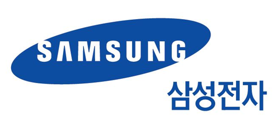
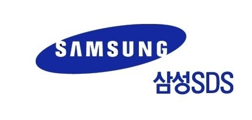
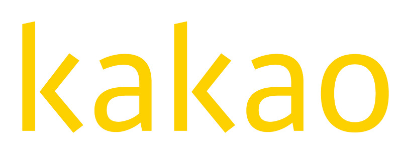
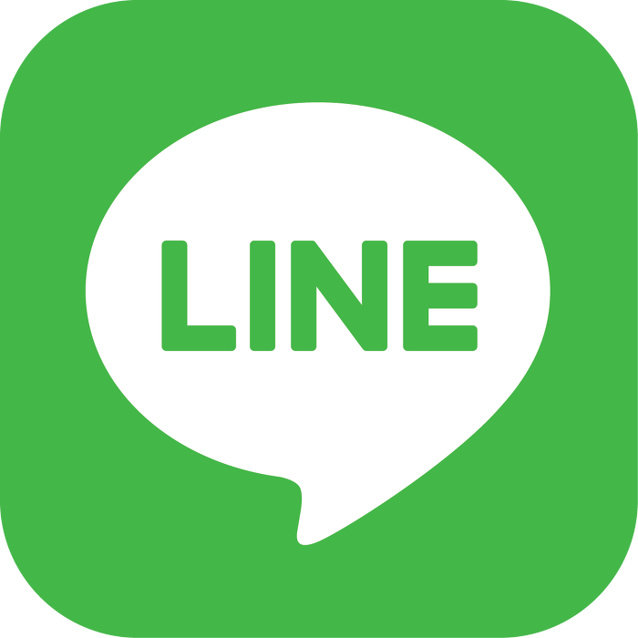
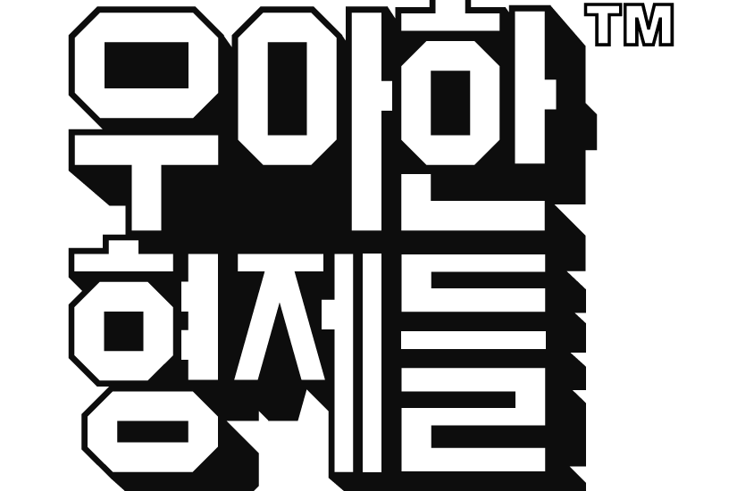
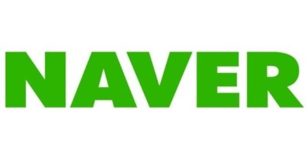

# 한동대학교의 PS 입문자를 위한 안내서

#### 이 문서는 PS가 무엇인지 접해보지 못한 사람들을 위한 안내서로, 이미 PS를 연습하고 계신 분들이라면 아래쪽에 "더 나아가서" 부분을 참고해주시길 바랍니다.

## 개요

PS란 **Problem Solving** 의 약자로, 주어진 문제에 대해 제한된 시간과 메모리 내에서 문제를 해결하는 행위를 일컫는 말입니다. 프로그래밍 경진대회 및 기업의 코딩테스트 모두 PS에 속하는 분야라고 할 수 있습니다. 점점 기업의 코딩 테스트가 중요해지는 시점에서 **문제를 해결하는 능력** 은 굉장히 중요해지고 있습니다. 2019년 12월 5일 현재, 입사하기 위해서 코딩테스트를 봐야하는 국내 기업 목록은 조금만 나열해봐도 아래와 같습니다.

이외에도 수많은 대기업 및 중소기업들이 코딩테스트를 첫 관문으로 두고 있으며 이를 통과하지 못할 경우, 면접조차 볼 수 없는 것이 현실입니다. 이런 현실 속에서 첫 관문을 헤쳐나가기 위해선 적정선의 PS 실력 이상을 반드시 갖추어야 합니다. 하지만 견고한 PS 실력을 갖추기 위해선 최대한 저학년부터 연습을 해야 그에 대한 사고력을 체계적으로 키울 수 있습니다.

## 어떤 언어를 사용해야 하나요?

사실 어떤 언어를 사용하던간에 그것이 문제가 되지는 않습니다. 중요한 건 문제를 해결하는 능력이기 때문입니다. 그래도 제일 많이 사용되고 알고리즘 문제를 풀기 위해 편한 언어는 C++, Java, Python 순서입니다. 1학년의 경우 C 밖에 배우지 않았기 때문에 방금 언급한 언어들은 따로 공부를 하셔야 합니다. 제가 가장 추천하는 언어는 C++ 이며 **C++의 문법에 익숙해진 다음 문제를 풀어보시는 것을 권유** 합니다. C++의 기본 사용법부터 STL(Standard Template Library)에 조금씩 익숙하게 되면 문제를 푸는데 어려움 없이 사용할 수 있습니다.

## 문제는 어디서 풀죠?

국내에서 가장 문제가 많은 사이트인 [**백준 온라인 저지**](https://acmicpc.net) 를 사용하여 문제풀이를 시작하는 것이 일반적입니다. 아직 가입하지 않았다면 가입하고 오시면 되겠습니다. 가입을 했으면 쉬운것, 즉 사람들이 가장 많이 푼 문제부터 시작해서 난이도를 점점 올려가면서 문제풀이를 연습하면 됩니다.

1. 먼저 백준에서 난이도별로 랭크를 표시해주는 확장 프로그램인 [**solved.ac**](https://solved.ac/) 를 설치합시다. 이 프로그램을 통해서 자신이 푸는 문제가 어느 정도의 난이도 인지 대략 알 수 있습니다.
2. 이제 [**단계별로 풀어보기**](https://www.acmicpc.net/step) 에서 **"입출력과 사칙연산"** 부터 **"재귀"** 부분까지 풀어봅시다.
3. 그 다음, [**C++ 배우기**](https://www.acmicpc.net/workbook/view/566) 문제집을 전부 풀어봅시다.
4. 다 풀었으면 [**구현**](https://www.acmicpc.net/problem/tag/구현) 으로 가서 1000명 이상이 푼 문제를 전부 풀어봅시다.
5. 여기까지 풀었으면, 백준 시스템에 익숙해졌고 기초적인 구현 능력을 갖추게 됩니다.
6. 자 이제, 기초적인 지식부터 차례대로 공부하면서 문제푸는 연습을 합시다. [**굉장히 좋은 블로그**](https://blog.naver.com/PostView.nhn?blogId=kks227&logNo=220769859177&categoryNo=299&parentCategoryNo=0&viewDate=&currentPage=13&postListTopCurrentPage=&from=postList&userTopListOpen=true&userTopListCount=5&userTopListManageOpen=false&userTopListCurrentPage=13) 를 통해서 쉬운 난이도의 알고리즘부터 차근차근 연습할 수 있습니다. (완전탐색, DFS, BFS, DP, 그리디, 분할정복, 이분탐색 ….)
7. 알고리즘을 공부한 뒤에 이분이 **추천하는 문제를 전부** 풀어보고, 그 외에도 **백준에 있는 비슷한 문제들을 풀어보는 방식** 으로 공부를 합시다.

여기까지 오셨다면, 이제 혼자 힘으로 PS를 공부할 역량을 갖추시게 되니 모르는 알고리즘/자료구조를 공부하면서 문제풀이 연습을 지속해서 하시면 됩니다 :) 백준 이외에도 [Codeforces](https://codeforces.com/) 를 통해 대회를 연습할 수 있고 [프로그래머스](https://programmers.co.kr/) 를 통해 코딩 테스트 환경을 연습해 볼 수 있습니다.

## 문제를 어떻게 풀죠?

1. 문제를 읽고 요구하는 바를 **명확히 이해** 합니다.
2. 요구하는 바를 어떻게 해결할지 **자신만의 알고리즘을 설계** 합니다.
3. 설계한 **알고리즘을 검증** 합니다.
   1. 설계한 알고리즘이 정말로 **요구하는 바를 충족시키는지 검증** 합니다.
   2. 설계한 알고리즘이 **제한된 시간/메모리 안에 돌아가는지 검증** 합니다.
4. 3에서 막히게 되면 다시 **2로 돌아가서 다른 알고리즘을 설계** 합니다.
5. 3을 해결했다면 선택한 언어로 **구현** 합니다.
6. 구현한 알고리즘이 틀렸으면 잘못 구현했는지, 혹은 알고리즘 자체가 틀렸는지 확인하고 그에 맞는 항목으로 이동합니다.
7. 구현한 알고리즘이 맞았으면, **다른 사람들은 어떻게 풀었는지 확인하며 회고** 합니다.

[**백준 1920번**](https://www.acmicpc.net/problem/1920) 문제를 통해서 예시를 들어보겠습니다.

1. 주어진 배열이 있고 숫자가 하나씩 주어질 때마다 해당 숫자가 배열에 있는지 없는지의 여부를 출력하는 것
2. 숫자가 주어질 때마다 배열을 전부 순회하면 되지 않을까?
3. 배열의 크기가 최대 10만이고 숫자의 개수도 최대 10만이므로 최대 100억번의 반복을 하는데 제한시간은 2초입니다. 보통 1억번의 연산이 1초안에 돌아가므로 시간초과가 발생합니다.
4. 그렇다면 배열을 정렬한 다음 이분탐색을 활용하면 시간이 줄지 않을까? 이분탐색은 O(lgN)의 시간 복잡도를 가지는 알고리즘으로 10만번의 연산을 lg(100000)번으로 줄여줍니다. 이제 최대 150만번의 연산을 수행하기 때문에 시간초과가 나지 않습니다.
5. [**구현**](https://www.acmicpc.net/source/9063095) 하고 제출했더니 맞았습니다.
6. [**맞은 사람**](https://www.acmicpc.net/problem/status/1920) 부분으로 들어가서 다른 사람들은 어떻게 풀었는지 보며 회고합니다.

## 문제를 풀다풀다 못 풀겠으면?

해결하지 못하는 문제들에 대한 의견은 분분한데, 이게 사람마다 다르기 때문입니다. 어떤 사람은 시간을 들여서 생각하며 해결하는 것을 좋아하고 또 다른 사람은 풀다가 답을 보고 이해하는 것이 더 중요하다고 생각합니다. 하지만 PS에 입문하셨다면 1시간 초과의 고민을 하는 것은 의미가 없다고 보는 것이 잘하시는 분들의 의견입니다. 즉, 그 정도로 고민했으면 못 푸는 문제인 것이고 해당되는 문제를 다른 사람들이 어떻게 풀었는지 구글링하여 풀이를 이해하고 내것으로 만드는 것이 더 낫다는 것입니다. 그래서 제 생각엔 아래와 같이 나뉜다고 생각합니다.

* 아예 실마리가 안 보일 경우 → **답을 보고 풀이를 이해** 하는 것이 좋다.
* 실마리가 보일 경우 → **계속해서 고민하고 구현** 해보는 것이 좋다.

저의 경우엔 먼저 해당 문제의 [**질문 검색**](https://www.acmicpc.net/board/search/all/problem/1920) 란을 보고 힌트를 찾습니다. 만약 여기서 못 찾으면 [**백준 슬랙**](https://www.acmicpc.net/slack) 에 들어가서 잘하시는 분들에게 힌트를 요청하거나 설계한 알고리즘을 검증받습니다. 그 다음, 여전히 풀리지 않는다면 그제서야 구글링을 해서 풀이를 보고 이해합니다. 만약, 구글링을 했는데도 풀이가 없는 경우라면 이 문제 말고도 풀 만한 수많은 문제들이 있기 때문에 쿨하게 넘어갑니다.

## 한동대학교에선 관련단체나 수업, 대회가 있을까요?

먼저 PS에 관련된 수업은 다음과 같은 것들이 있습니다.

* **자료 구조(Data Structures)**
* **알고리즘 분석(Algorithm Analysis)**
* **컴퓨터 과학적 사고를 통한 문제 해결(Problem Solving through Computational Thinking)**

공식적인 단체는 1개가 있지만 CRA 혹은 Ghost와 같은 동아리에서 주도적으로 하고 있는걸로 압니다.

* **HPS(Handong Problem Solvers) 학회**
  * [**백준 그룹**](https://www.acmicpc.net/group/practice/5597) 을 통해서 같이 연습할 수 있습니다 :)

학교에서 참가할 수 있는 대회는 아래와 같습니다.

* **ACM-ICPC** (10만원을 내는 것으로 규정이 바뀌어서 학교에서 지원해줄지는 의문입니다.)
* **대구 및 경북권 프로그래밍 경진대회 ( = 대경권)**
  * 대경권이 제일 비벼볼만한 대회로 계속해서 꾸준히 한다면 수상을 할 수 있다고 생각합니다.

이외에도 다른 대회로, **UCPC(전국 대학생 프로그래밍 경진대회)** 및 **SCPC(삼성 프로그래밍 경진대회)** 를 자체적으로 참여할 수 있습니다.

## 마지막으로, PS에 임하는 태도

잘하시는 수많은 분들이 얘기하시는 것을 토대로 제가 깨달은 바를 얘기하자면, 문제풀이는 아래와 같은 태도를 가져야 합니다.

1. **쉬운 문제** 를 푸는 것은 **구현력** 이 상승하지만 **문제 해결 능력** 은 **도전이 될 만한 문제** 를 풀 때 상승합니다.
2. 왕도가 없습니다. **다작(多作)** , 즉 자신에게 도움이 되는 문제를 많이 푸는 것이 실력상승의 지름길입니다.
3. 많이 푸는 것만큼 중요한 것이 **꾸준히 푸는 것** 입니다. 최소 2일에 1문제는 꼭 푸는 습관을 가지면 정말 좋습니다.

**인백기천(人百己千)** 이라는 사자성어가 있습니다. 남들이 100번 노력할 때 자신은 1000의 노력을 해야 한다는 말입니다. 어느 분야든 성실해야 하는 것은 맞지만, 이 분야는 실력을 늘리는 것에서 벽을 마주할 때가 정말 많기 때문에 이런 마인드로 공부하면 정말로 실력이 상승할 것입니다.

## 더 나아가서

이미 연습하고 계신 분들, 혹은 위 과정에 익숙해진 분들에겐 **잘하시는 분들이 쓰신 글** 들을 추천합니다.

* [수비니움님, 개인이 생각하는 알고리즘(PS/CP) 공부 유형 및 보완법](https://subinium.github.io/PS-Study-Types-and-Complements/)
* [박트리님, 알고리즘 공부, 어떻게 해야하나요?](https://baactree.tistory.com/52)
* [plzrun님, 알고리즘 문제풀이(PS) 시작하기](https://plzrun.tistory.com/entry/알고리즘-문제풀이PS-시작하기)